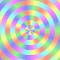

Wallgen
=======

Generate background wallpapers.
All image output will be in [.ppm format (P6)](https://en.wikipedia.org/wiki/Netpbm_format).

Usage: ` ./program 1920 1080 > wallpaper.ppm`

Where 1920 and 1080 can be replaced with the dimensions you which the generated image to have.
You can use imagemagic to convert the `.ppm` image into a format which might be more suitable for a desktop image.

All generators can be executed with **width**x**height** startup parameters.
But some programs have optional parameters.
Try executing a generator without any parameters and it will print parameter usage documentation.

Samples
-------

